<picture>
  <source media="(prefers-color-scheme: dark)" srcset="dark.svg">
  <source media="(prefers-color-scheme: light)" srcset="light.svg">
  
</picture>

 

<!-- Connect — real clickable links (the icons inside the banner above are visual only) -->

 

## About Me

- 🎓 Sophomore at **Birla Institute of Technology, Mesra**
- 🧠 Focused on **AI/ML Engineering** — building things like invisible captchas and sentiment models
- 🎨 Passionate about **UI/UX and Graphic Designing**
- 🟢 **Open to work**
- 📫 Reach me at **sahajp246@gmail.com**

 

## Tech Stack

**Languages**

**Frontend**

**AI / ML**

 

## Featured Projects

### 🛡️ [SilentShield](https://github.com/btech1056625-dev/firebase_silentshield)
Invisible captcha system built to verify users without interrupting them.

### 💬 [Sentiment Analysis](https://github.com/sahajp246-cpu/EDA-Analysis)
Exploratory data analysis and sentiment modeling project.

 

## Certifications

- 📜 **Google's Machine Learning Operations (MLOps) on Google Cloud** Specialization
- 📜 **Reliance Foundation Skilling Academy** — IoT Network Specialist Certificate

 

## GitHub Stats & Contributions

  

 

*Thanks for stopping by — always open to interesting projects and collaborations.*

